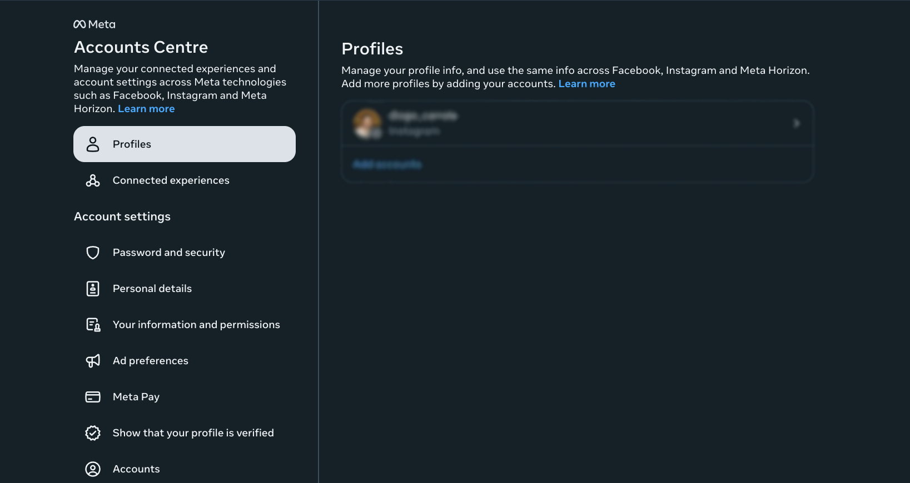
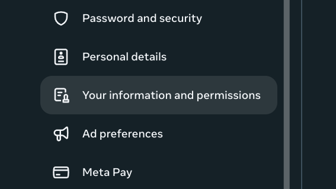
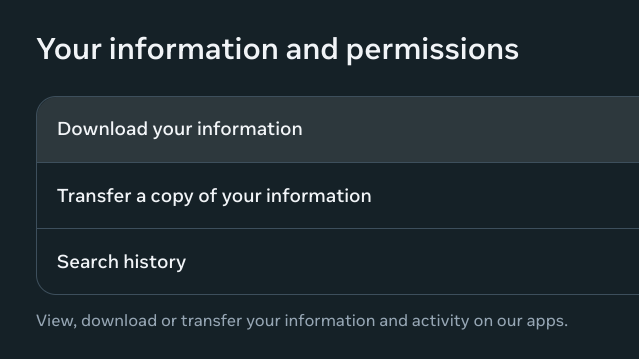
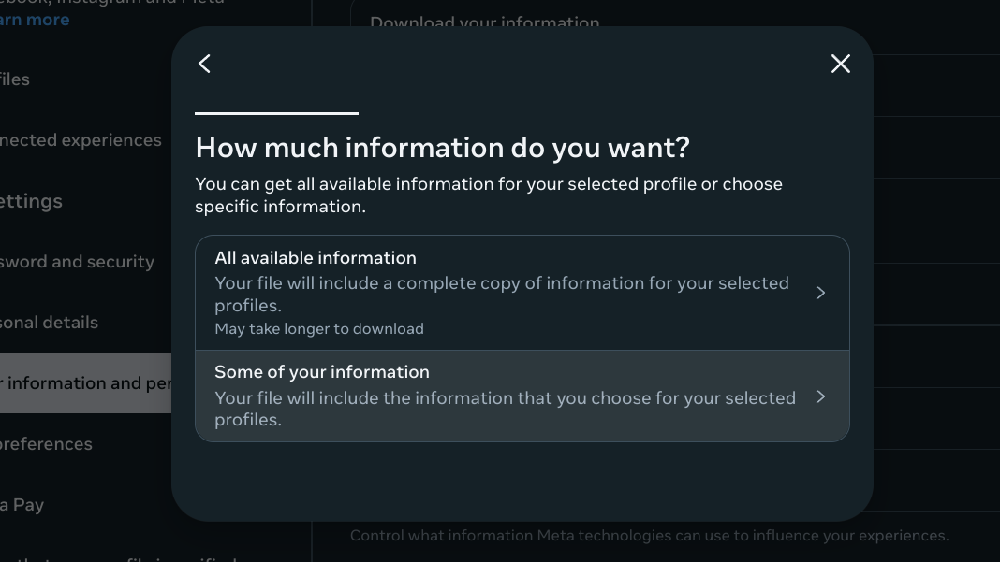
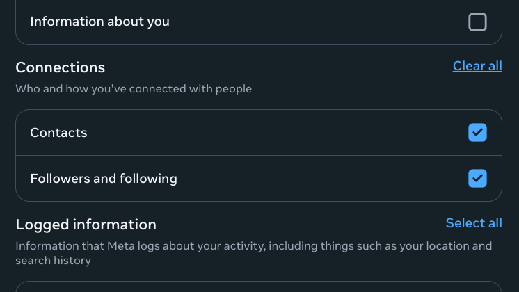
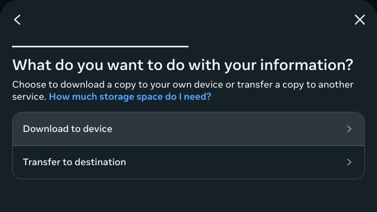
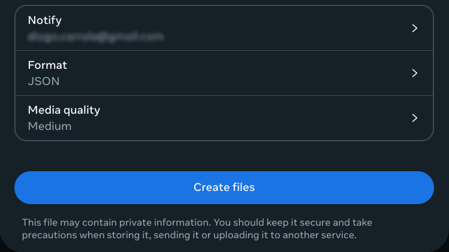
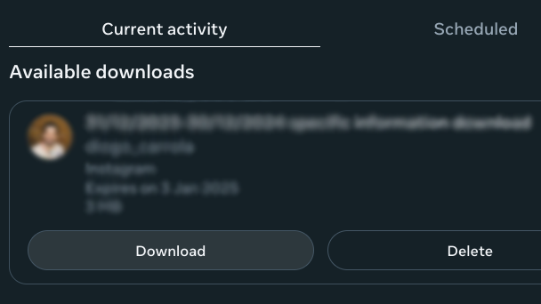
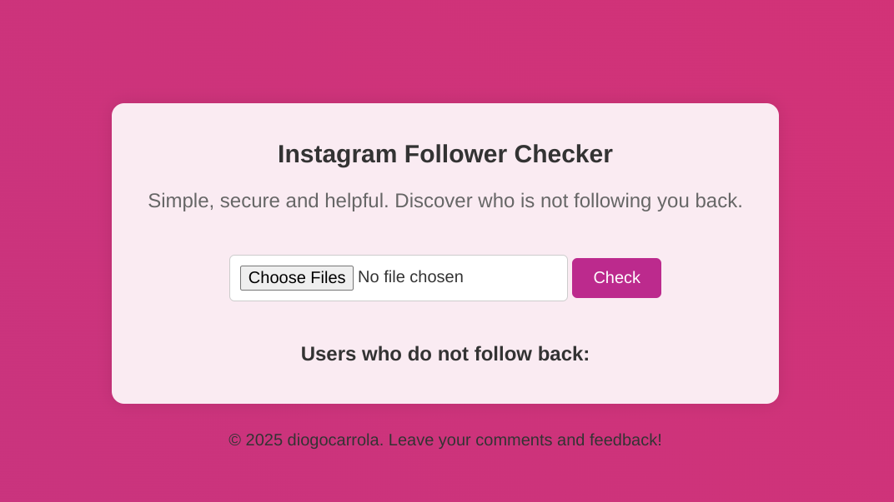

# Instagram Follower Checker

A simple tool to check which Instagram users do not follow you back.

## How to Use

### Step 0: Download Your Instagram Data

1. Go to [Instagram Account Center](https://accountscenter.instagram.com/?theme=dark&entry_point=app_settings).

   <div style="text-align: center;">
       
   </div>
2. Select **Your Information and Permissions**.

   <div style="text-align: center;">
       
   </div>
3. Click on **Download Your Information**.

   <div style="text-align: center;">
       
   </div>
4. Select **Download or Transfer Information**, then **Some of Your Information**.

   <div style="text-align: center;">
       
   </div>
5. Scroll to **Connections** and select **All**.

   <div style="text-align: center;">
       
   </div>
6. Click **Next**, then **Download to Device**.

   <div style="text-align: center;">
       
   </div>
7. Ensure the format is set to **JSON** and select **Create Files**.

   <div style="text-align: center;">
       
   </div>
8. You will receive an email with a link to download your data. Click the link and download the ZIP file.

   <div style="text-align: center;">
       
   </div>

### Step 1: Extract the Data Files

1. Unzip the downloaded ZIP file.
2. Ensure that the extracted folder contains the `followers.json` and `following.json` files.

### Step 2: Use the Instagram Follower Checker

   <div style="text-align: center;">
       
   </div>

1. Open the [Instagram Follower Checker](https://diogocarrola.github.io/insta-follow-checker) in your browser.
2. Click on the **Choose Folder** button and select the folder containing the `followers.json` and `following.json` files.
3. Click the **Check** button.
4. The tool will display a list of users who are not following you back.

## Development

To run this project locally:

1. Clone the repository:
    ```bash
    git clone https://github.com/diogocarrola/insta-follow-checker.git
    cd insta-follow-checker
    ```

2. Open `index.html` in your browser.

## License

This project is licensed under the MIT License - see the LICENSE file for details.
